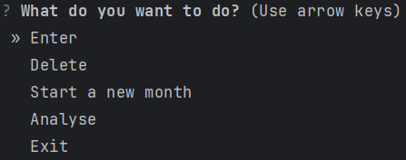
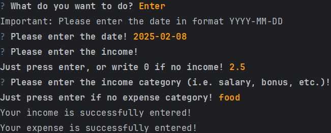
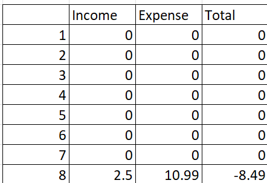
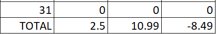
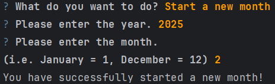
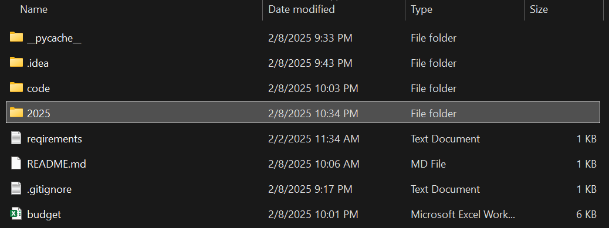
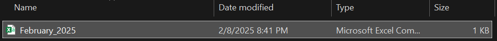

# My Budget Tracker App

A budgeting app is designed to help users optimize their spending and savings choices they make each month.<br>By putting all financial commitments and goals in one place, a budgeting app can give users better visibility into their financial choices and habits.

## Criteria

- The Budget Tracker application was built using `Python version 3.11.5`.

## User Actions

The user is provided with the following actions:<br><br>
<br><br>
Data entry:<br><br>
<br><br>
The `budget.xlsx` has changed:<br><br>
<br><br>
<br><br>

> [!NOTE]
> If the user again chooses the same day for the data entry, the data he has entered will sum-up to the existing data!

If the user chooses __Start a new month__:<br><br>
<br><br>
Note the folder was created:<br><br>
<br><br>
And there is a "year_month.csv" file:<br><br>
<br><br>

## Installation

```commandline
pip install -r requirements.txt
```

## Usage

Start

```commandline
python code/main.py
```

and follow the instructions on the screen.

## Author

The project was developed by [Anri Stepanian](https://github.com/anristepanian)
