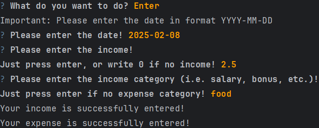
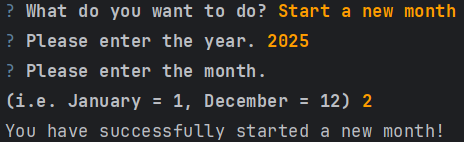
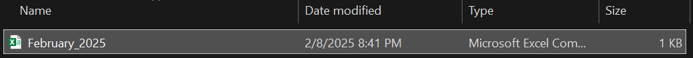

The user is provided with the following actions:  
  
Data entry:  
  
The `budget.xlsx` has changed:  
  
  

> [!NOTE]
> If the user again chooses the same day for the data entry, the data he has entered will sum-up to the existing data!

If the user chooses __Start a new month__:  
  
Note the folder was created:  
  
And there is a "year_month.csv" file:  
  
